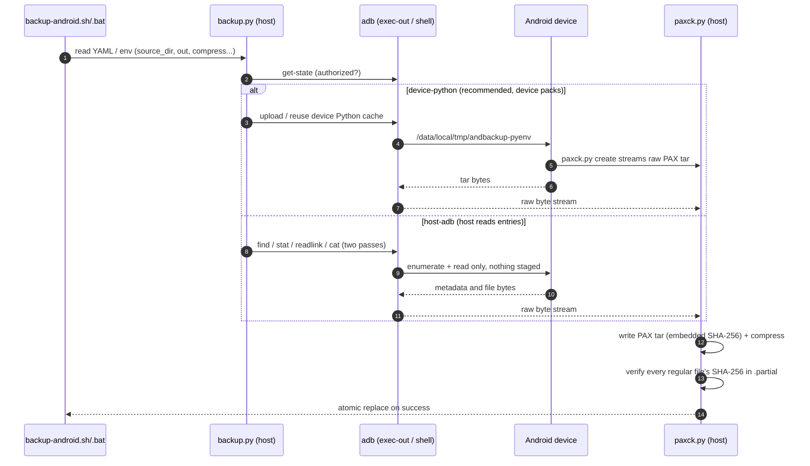

# AndBackup

[Chinese README](README.md) | [English architecture notes](docs/flow.en.md) | [English testing notes](docs/testing.en.md) | [Configuration and CLI reference](docs/configuration.en.md)

AndBackup has two independent pieces:

- `paxck.py` creates a streaming POSIX PAX tar archive for a local directory,
  with a SHA-256 PAX header on every regular file, and exposes one CLI
  (`create`/`compress`/`verify`/`extract`). Verification and extraction live in
  `paxverify.py` and `paxextract.py`, which the CLI imports lazily, so the
  writer itself depends on neither — that is what `device-python` mode uploads.
- `adb_source.py` makes an ADB-shell-readable Android directory a source for
  the same archive writer. `backup.py` combines that source with compression,
  verification, and atomic replacement of the final host archive.

Android backup reads the device directory through one of two source modes:
`device-python` (recommended, the shipped example-config default) and `host-adb`
(the low-dependency alternative). A failed mode is never auto-switched to the
other; see “Modes and Architecture” below.

## Requirements

- Python 3.12 or later. There are no third-party Python dependencies.
- Android Platform-Tools `adb` for Android backups. The generic local packer
  does not require ADB.
- An ADB-authorized device and an ADB-shell-readable directory under
  `/storage/emulated/0` for Android backups.
- Use `cmd.exe` for the Windows `.bat` wrapper and binary pipelines. Do not
  put the archive stream through a PowerShell text pipeline.

`xz`, `gzip`, and uncompressed tar use the Python standard library. `zstd`
uses Python 3.14+'s `compression.zstd` when available, otherwise a `zstd`
executable on `PATH`.

At v0.2.0 release preparation the full offline suite passed on Windows
CPython 3.13.15 (153 tests, 0 failures); cross-platform selector cases (the
3.14 stdlib `compression.zstd` and the older system-`tar` extraction paths)
were run on WSL Ubuntu CPython 3.14.4. Python 3.12 is the declared minimum and
is covered by the post-push CI matrix, but was not installed locally solely for
this release. Ubuntu 24.04 ships Python 3.12; Debian 12 ships Python 3.11, so
Debian 12 users need to provide a separate Python 3.12+ interpreter.

## Android Quick Start

Create the ignored local configuration from the tracked, endpoint-free
template. Do not commit the resulting `src/backup-android.yaml`.

```sh
cp src/backup-android.example.yaml src/backup-android.yaml
```

```bat
copy src\backup-android.example.yaml src\backup-android.yaml
```

Edit the copied file. Its supported top-level YAML keys are:

The shipped template (`backup-android.example.yaml`) defaults to
`source_mode: device-python` (recommended); `download_device_python` then
defaults to `true`, so the first run downloads and caches the interpreter.
Where a key is absent the conservative built-in applies (built-in `source_mode`
is `host-adb`, and `download_device_python` is `false` unless the mode is
`device-python`; no mode ever auto-switches to the other).

| Key | Meaning |
|---|---|
| `adb` | ADB executable, default `adb`. |
| `host` | Wireless endpoint: `IP` or `IP:port`; non-empty runs `adb connect` automatically (aliases `address`/`ip`). |
| `serial` | ADB serial as shown by `adb devices` (first column, equivalent to `adb -s SERIAL`; e.g. `AERF6R4517018096`, `adb-…._adb-tls-connect._tcp`); empty auto-selects (one device directly; multiple are listed for an interactive choice, error when non-interactive). The `-t` transport id is only needed when serials repeat. Legacy `device_id`/`device`/`adb_serial` still map here. |
| `source_dir` | Android absolute directory to back up. |
| `out` | Host output archive path. |
| `compress` | `xz`, `gzip`, `zstd`, or `none`; empty/absent means `none` (uncompressed). |
| `source_mode` | `host-adb` (host reads entries) or `device-python` (device packs via an uploaded Python). The shipped template sets `device-python`. |
| `device_python` | Used by `device-python`: a local path to an Android ARM64 Python — a standalone interpreter file or a python install prefix directory (`bin/` + `lib/`). |
| `download_device_python` | Fetch the pinned upstream interpreter when `device_python` is empty. Defaults to `true` when `source_mode: device-python`, otherwise `false`. |
| `device_python_url` | Overrides the pinned `device_python_url` download URL; may be a local `.tar.zst` path for offline reuse. |
| `keep_android_env` | `device-python`: `true` keeps the device interpreter cache after the run, `false` removes it, unset asks (remove when non-interactive). |

Device selection: `host` is the wireless endpoint (`IP` or `IP:port`; non-empty
connects automatically), and `serial` pins a specific adb device (USB serial or
mDNS id; equivalent to `adb -s SERIAL`). With both empty, one online device is
used directly and several are listed for an interactive choice (an error when
non-interactive).

USB configuration normally leaves both `host` and `serial` empty for one
connected device, or sets `serial` to the USB serial for a multi-device host:

```yaml
adb: adb
host: ""
serial: ""
source_dir: "/storage/emulated/0/DCIM"
out: android-backup.tar.xz
compress: xz
source_mode: device-python
log_level: info
progress_interval: 5
```

For wireless debugging, first pair the host in Android's Wireless debugging
screen, then put the separately displayed *connection* endpoint, not the
pairing endpoint, into `host` (an IP alone also works; adb uses its default
port):

```yaml
host: "192.0.2.1:5555"
```

When Android changes its wireless connection port, update only `host`. Only a
non-empty `host` triggers `adb connect`; leave it empty for USB.

Run the matching thin wrapper:

```sh
src/backup-android.sh
```

```bat
src\backup-android.bat
```

Both forward their arguments to `backup.py`, so a configuration elsewhere can
be selected explicitly:

```sh
src/backup-android.sh --config /path/to/site-backup.yaml
```

```bat
src\backup-android.bat --config D:\backup-config\site-backup.yaml
```

Configuration precedence is `--config PATH`, `BACKUP_CONFIG_FILE`, then an
existing sibling `src/backup-android.yaml`. The operational environment
variables `ADB`, `HOST`, `SERIAL`, `ANDROID_SERIAL`, `SOURCE_DIR`, `OUT`, `COMPRESS`,
`SOURCE_MODE`, `DEVICE_PYTHON`, `DOWNLOAD_DEVICE_PYTHON`, `DEVICE_PYTHON_URL`,
`KEEP_ANDROID_ENV`, `LOG_LEVEL`, `PROGRESS_INTERVAL`, and `SHOW_RATE` override
YAML values (the legacy `DEVICE_ID`/`DEVICE`/`ADB_SERIAL` names still map to
`SERIAL`; `ANDROID_SERIAL` is accepted, matching adb itself).
`PYTHON` selects the interpreter for the wrappers.

`out` interpretation: empty writes `backup.tar.<suffix>` in the current
directory; pointing it at a directory (existing, or ending in `/` or `\`) writes
`<tail of source_dir><suffix>` into that directory; pointing it at a file whose
extension differs from the compressor's theoretical suffix
(`.tar.xz`/`.tar.gz`/`.tar.zst`/`.tar`) is written verbatim in non-interactive
runs, while an interactive terminal is asked whether to append the suffix.
Relative paths always resolve against the **working directory you launch from**
(wherever you run `backup-android.sh`/`.bat` or `backup.py`), not the config
file's directory and not the script directory; a missing target directory is
created automatically.

Message language: command-line text follows the environment by default
(`--lang zh|en|auto` or `ANDROBACKUP_LANG` forces it; the fallback is English,
and `backup.py` passes the chosen language to the tools it spawns). Help text,
errors and progress all switch, while the tags `[ERROR]`/`[WARN]`/`[DONE]`/
`[PROGRESS]` stay language-neutral so scripts can match them. Detection tries
`--lang`, then `ANDROBACKUP_LANG`, `LC_*`/`LANGUAGE`/`LANG`, the OS language (on
Windows the *user interface* language, so a Chinese Windows prints Chinese),
then English; OS error wording is translated from the `errno`, so a message
never mixes two languages.

## Modes and Architecture

Android directories are read in one of two explicitly selected modes; a failed
mode is never auto-switched to the other (`device-python` never falls back to
the slower `host-adb`):

- `device-python` (recommended; the shipped example-config default): with
  `download_device_python: true` the first run fetches an interpreter matched to
the device ABI and caches it at the fixed directory
  `/data/local/tmp/andbackup-pyenv`, then the device streams a raw PAX tar to
  stdout for host-side compression. No archive or compressed file is created on
the device; the interpreter is validated and reused from the cache, or removed
  per the caching rules (see [docs/configuration.en.md](docs/configuration.en.md)).
- `host-adb`: the host reads entries one by one over `adb exec-out`; the device
  only runs `find`/`stat`/`readlink`/`cat` and never receives an archive,
  compression binary, Python runtime, or temporary file. Use it when fully
  offline or when you do not want an interpreter written to the device.

In both modes files travel as binary data over `adb exec-out`; the host builds,
compresses, and verifies the archive:



## Local Archive Workflow

`paxck.py` can be used without Android or ADB:

```sh
python3 src/paxck.py create /path/to/local-directory \
  | python3 src/paxck.py compress xz > local.tar.xz
python3 src/paxck.py verify -i local.tar.xz
python3 src/paxck.py extract -i local.tar.xz -C local-restored
```

The Android source adapter can be composed manually, although `backup.py` is
recommended for actual backups because it checks both pipe processes and
publishes output atomically. Before touching the device it also pre-flights the
output target with the same `OUT.partial.*` placeholder: a target that already
exists and is a directory, is not a regular file, sits under a path component
that is a file, lives in an unwritable directory (or, on Windows, is read-only
or held open) fails **before any transfer**, and an interactive terminal may
pick another path. If the final rename still fails, the verified archive is
kept at that `.partial.*` path instead of being discarded.

```sh
python3 src/adb_source.py pack --adb adb /storage/emulated/0/DCIM \
  | python3 src/paxck.py compress xz > android.tar.xz
python3 src/paxck.py verify -i android.tar.xz
```

For `device-python`, set `source_mode: device-python` and `device_python` in
YAML (or the `SOURCE_MODE`/`DEVICE_PYTHON` environment variables), then run the
same wrapper. `DEVICE_PYTHON` may be a single self-contained interpreter file or
a python install prefix directory (`bin/` + `lib/`); a directory is packed into
one tar, uploaded, and extracted on the device. The Python must be compatible with the device ABI/linker (static musl aarch64
builds work well). The interpreter is cached at `/data/local/tmp/andbackup-pyenv`;
each run checks the stamp and `--version`, reusing a valid cache and otherwise
re-provisioning it. After a run that created the env, an interactive terminal
is asked whether to keep it (Enter = keep); non-interactive runs remove it
unless `keep_android_env: true`. Delete the device env with `backup.py clean env` and
the host download cache with `backup.py clean host-cache` (see
[docs/configuration.en.md](docs/configuration.en.md)). If `device-python`
cannot run, the controller fails instead of silently falling back to
`host-adb`.

The interpreter is not bundled with the repository. To have the controller
fetch it on demand, set `download_device_python: true`; when `device_python` is
empty or points to a path that does not exist yet, `backup.py` downloads the
pinned
[python-build-standalone](https://github.com/astral-sh/python-build-standalone)
release (override the URL with `device_python_url`, or point it at a local
`.tar.zst` for offline reuse) and unpacks it into `device_python` or the
per-user cache (`%LOCALAPPDATA%\andbackup` on Windows, `~/.cache/andbackup`
elsewhere). Later runs reuse the cache without network access. Decompression
needs no third-party Python package: Python 3.14+'s standard-library
`compression.zstd`, an external `zstd`, or the OS `tar` (Windows `bsdtar`
handles zstd).

On Windows, run equivalent binary pipelines from `cmd.exe`:

```bat
py src\paxck.py create "C:\source" ^
  | py src\paxck.py compress xz > local.tar.xz
py src\paxck.py verify -i local.tar.xz
py src\paxck.py extract -i local.tar.xz -C local-restored
```

## Public Interfaces and Differences

The complete command-line tables for `paxck.py`, `adb_source.py`, and
`backup.py`, the supported YAML keys/environment variables, the cache and
cleanup rules (`keep_android_env`, `backup.py clean env|host-cache|all`), and
compression notes live in [docs/configuration.en.md](docs/configuration.en.md).
Archive metadata fields, time precision, Android permission boundaries, and the
comparison against uploading an independent tar binary to the device live in
[docs/flow.en.md](docs/flow.en.md). Every entry point uses the
**`executable FUNCTION [options…]`** grammar: `paxck.py
create|compress|verify|extract`, `adb_source.py pack`, `backup.py
backup|tree|clean`, so the command line says whether this run lists, backs up or
cleans (the old `--list-tree`/`--clean-*` spellings fail with the new form).
`backup.py tree [--tree-out PATH]`
lists just the detailed tree of the source directory (mode, numeric owner/group
UID:GID, size, time, symlink targets) to stdout or to a file, writes no archive,
and costs one adb round trip per entry, so large trees are slow.

`backup.py backup --prune-source [--prune-dry-run]` deletes the source entries that
were really packed **after the archive was verified and published**, to free
space on the device. It is command-line only on purpose (no YAML key, so a
one-time setting cannot silently delete sources later) and it only touches
entries that made it into the archive: entries the adapter skipped (permissions,
scoped storage, modified while packing, non-regular files) and the source root
are never deleted, and directories are removed only when their listing was
complete with nothing skipped underneath, using `rmdir` rather than `rm -rf`
(with an incomplete listing only files and symlinks are deleted).
`--prune-dry-run` only prints the plan; an interactive terminal confirms once;
a failed backup or verification deletes nothing.

An existing target file (the name including its suffix) is never replaced
silently: an interactive terminal asks "Overwrite it? [y/N]" (the default is no;
answering `n` or Enter offers another path), and a non-interactive run fails
with a hint to add `--force`, so an unattended run cannot clobber the previous
backup. `-f`/`--force` (or `force: true` in the config) skips the question and
overwrites; it only decides *whether to ask*, it does not bypass targets that
genuinely cannot be written.
Archive semantics, security rules, and the exit-code table follow below.

## Archive Semantics and Security

Archives are Python `tarfile.PAX_FORMAT`. The writer stores path, type,
portable mode bits, modification time, link target, and regular-file size.
Local regular files also retain source UID/GID in their tar headers. Android
entries use default UID/GID because the ADB adapter does not collect them.
The tool does not write xattrs, ACLs, SELinux labels, atime, ctime, birth time,
user/group names, device IDs, sockets, FIFOs, or device nodes.

Android modification time is read from `stat` `%Y` plus the observable
fraction in `%y`. The source filesystem, Android FUSE/storage implementation,
and Python/PAX representation determine actual precision; a displayed nine
digit fraction is not a universal promise of nanosecond storage precision.
Android shell permissions and scoped-storage boundaries can also prevent
access to some metadata and directories. Those are platform boundaries, not a
claim that a different compression format could recover unavailable metadata.

Readability of app directories depends entirely on the permissions other apps
set when creating files. `adb shell` (uid 2000) can read an entry only when it
is readable by the `ext_data_rw` group or by `other`. Files owned by another
app's uid with mode `0600`/`0660` — typically PDFs written by a document
service such as Honor Docs Service — cannot be read and are skipped with
`[WARN]` (measured: 81 of 1259 entries in one QQ receive directory, owner uid
`10203`, mode `0660`, while QQ's own files are uid `10183`, mode `0766` and
readable); re-save or share them from an app that can reach them into
`/sdcard/Download/` and back that up instead. The target app's temporary
directories (e.g. `.TbsReaderTemp`, grouped to the app itself) may not even be
enterable. Use `backup.py tree` to inspect first (owner/group appear as
numeric UIDs/GIDs; one adb round trip per entry, so large trees are slow).

Some Windows `adb.exe` transports merge remote shell stderr into `exec-out`
stdout. `adb_source.py` discards that remote stderr and removes an internal
NUL-delimited status trailer before writing the tar stream, so diagnostics
cannot become path or file bytes. When `find` reports inaccessible descendants,
the source emits `[WARN]`, skips the unreadable entries, and the archive is
**still verified and published**. Only a run that can enumerate nothing at all
(no archiveable entry) produces no file. Missing roots, protocol corruption,
compression errors, and files changing between the two reads remain hard
failures.

Default extraction accepts only directory, regular-file, symlink, and hardlink
members. It rejects empty, duplicate, absolute, backslash, dot, parent, NUL,
and Windows-drive-style member names, and never follows an archive symlink
while creating later members. Symlink targets themselves are preserved as tar
semantics and may be absolute or dangling. Do not use `--direct-tarfile` with
untrusted input.

## Exit Codes

| Code | Meaning |
|---|---|
| `0` | Successful command. |
| `1` | Invalid argument, invalid/unverifiable archive, unsafe verified extraction input, an output target that cannot be written (or that was not confirmed), or ordinary ADB/root-path failure. |
| `2` | zstd input/output was requested but neither standard-library nor external zstd support is available. |
| `3` | Irrecoverable source, compression, or extraction destination I/O failure. The output must not be considered a successful backup. |

## Testing

Run the complete offline suite:

```sh
python3 -m unittest discover -s tests -t . -v
```

```bat
py -m unittest discover -s tests -t . -v
```

Real-device tests are opt-in: provide `ANDROBACKUP_DEVICE_DIR` explicitly so
the repository does not assume a private device path. USB tests can leave the
serial empty; wireless tests use the current connection `host:port` and may set
`ANDROBACKUP_ADB_CONNECT=1` to connect first.

```sh
ANDROBACKUP_ADB=/path/to/adb \
ANDROBACKUP_DEVICE_DIR=/storage/emulated/0/DCIM \
python3 -m unittest -v tests.test_device_integration
```

See [testing notes](docs/testing.en.md) for coverage and Windows/CMD details,
and [architecture notes](docs/flow.en.md) for pipeline and metadata details.

## License

Released under the [MIT License](LICENSE). See [CHANGELOG.md](CHANGELOG.md)
for version history, [release-0.2.0.md](docs/release-0.2.0.md) for the current
release notes/checklist, and [release-0.1.0.md](docs/release-0.1.0.md) for the
initial release.
