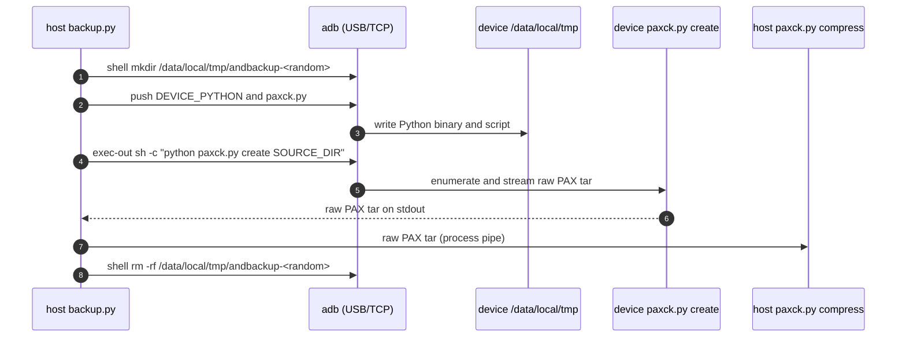

# AndBackup Architecture

[Chinese version](flow.md) | [English README](../README.en.md)

## Responsibilities

The project separates source acquisition from archive handling:

- `paxck.py` is the generic host-side PAX writer, compressor, verifier, and
  extractor. It has no ADB dependency.
- `adb_source.py` adapts an Android directory to that writer. It lists paths,
  reads metadata, reads symlink targets, and streams regular-file bytes through
  `adb exec-out`. This is the `host-adb` data source.
- `backup.py` is the Android production controller. It merges configuration,
  performs an optional TCP `adb connect`, selects the source mode, runs the
  source and compressor, verifies a unique host-side partial archive, then
  atomically replaces the requested output. With `source_mode: device-python`
  it uploads a user-provided Android Python binary and `paxck.py`, then runs
  `paxck.py create` on the device.
- `backup-android.sh` and `backup-android.bat` are deliberately thin POSIX and
  CMD forwarding wrappers.

```text
Android files -- adb exec-out --> adb_source.py -- raw PAX --> paxck.py compress
                                                             |
                                                        host .partial archive
                                                             |
                                                        paxck.py verify
                                                             |
                                                        atomic final output
```

The diagram above is the default `host-adb` mode. There, the Android device
only runs `find -print0`, `stat`, `readlink`, and `cat` as the ADB shell user.
It does not run tar, a compressor, Python, or receive a temporary archive.

## Source Modes

The controller reads `source_mode` and never auto-switches between modes.

### `host-adb` (default)

The host enumerates and reads each entry over separate `adb exec-out`
invocations (see the consistency model below). This keeps the device free of
any uploaded executable, but many small files pay one ADB round trip per
`stat` and per file read.

### `device-python`

The host uploads the user-provided Android ARM64 Python (`DEVICE_PYTHON`) and
`paxck.py` to a unique `/data/local/tmp/andbackup-*` directory, then runs
`paxck.py create SOURCE_DIR` on the device. `DEVICE_PYTHON` may be a single
self-contained interpreter file or a python install prefix directory (`bin/` +
`lib/`); a directory is packed into one tar, uploaded, and extracted on the
device so the interpreter can resolve its standard library. The device writes a
raw PAX tar to stdout; the host compresses and verifies it exactly as in
`host-adb`.



Because the device runs the same `paxck.py create` writer, `device-python`
keeps the two-pass read and `PAXCK.checksum.sha256` semantics. It is useful
When many small files make `host-adb` round trips too slow, or when directory
walking is faster on the device. The device temporarily holds only the Python
and `paxck.py`; it does not create an archive or compressed file, and
the controller removes the temporary directory when done. A missing or
incompatible Python is a hard error — the controller does not fall back to
`host-adb`.

The interpreter is not shipped with the repo. Set `download_device_python:
true` to let the controller fetch the pinned python-build-standalone release
(`device_python_url` overrides it and may be a local `.tar.zst` for offline
use) and unpack it into `device_python` or a per-user cache when no usable
interpreter is present. Extraction uses only the Python standard library, an
external `zstd`, or the OS `tar` (Windows `bsdtar`), never a third-party Python
package.

The host counts bytes received from the device tar stream and can report
progress and rate on stderr (controlled by `log_level`, `progress_interval`,
and `show_rate`), without altering archive bytes.

## ADB Transports

USB and wireless debugging use the same data protocol. For USB, leave `device`
empty for one device or set it to the USB serial when several devices are
attached. For wireless debugging, pair first, then set `device` to the currently
displayed `host:connection-port`; the controller runs `adb connect` first only
for `host:port` values. With `device` empty, the controller enumerates
`adb devices`: one online device is used directly, several are listed for an
interactive choice (non-interactive runs error out), and zero is an error.

The controller exports the selected serial as `ANDROID_SERIAL` for every ADB
subprocess. `exec-out` is kept as a binary subprocess pipe. In particular,
Windows CMD redirects Python's binary stdout; it must not be replaced by a
PowerShell text pipeline, which can alter arbitrary archive bytes.

Some Windows `adb.exe` versions/transports merge remote shell stderr into
`exec-out` stdout. The adapter discards remote stderr and appends an internal
NUL-delimited status trailer to each command, removing that trailer before PAX
writing. If scoped storage, permissions, or the shell UID prevent access to a
descendant, it emits `[WARN]`, skips unreadable entries, writes a valid partial
archive, and exits `3` to report incompleteness. Missing roots, protocol
corruption, compressor failures, and files changing between the two reads
remain hard failures, matching common tar behavior.

`log_level` accepts `quiet`, `error`, `warn`, `info`, `debug`, or `trace`.
`progress_interval` sets the minimum status interval in seconds (at least
`0.1`). Set `show_rate: true` or pass `--show-rate` to include the measured
ADB payload rate. Enumeration progress reports discovered entries and listing
bytes before archive writing starts, which makes a slow or blocked `find`
visible.

## Consistency Model

For each Android regular file, the adapter:

1. Gets type, mode, size, and modification time using `stat`.
2. Reads the file once to calculate SHA-256 and actual length.
3. Refuses the backup when that length differs from `stat`.
4. Reads it again directly into the tar stream, checking that the second read
   has exactly the expected length and that ADB exits successfully.

This bounds memory by the stream chunk size and turns concurrent source changes
into a failure rather than a silently successful partial backup. Local
`paxck.py create` uses the same two-pass rule for regular files.

## PAX Contents

The writer uses `tarfile.PAX_FORMAT`. It writes `name`, tar type, mode, mtime,
size, link target, and `PAXCK.checksum.sha256` on regular files. Local regular
files receive source UID/GID headers; the Android adapter leaves UID/GID at
their tar defaults because it does not collect them.

The project does not currently record uname/gname, atime, ctime, creation time,
inode, device number, xattrs, ACLs, file flags, SELinux labels, or special
files. Android `%y` supplies observable fractional mtime and `%Y` its integral
epoch value. The filesystem/ROM/FUSE implementation controls the actual stored
precision; test a particular path with:

```sh
adb shell "stat -c '%y|%Y' -- /storage/emulated/0/path/to/file"
```

Android scoped storage, Unix permissions, and the ADB shell UID can deny or
synthesize metadata. The absence of unsupported fields is an explicit archive
scope decision; changing compression cannot recover data that was not readable
or collected.

## Extraction Modes

`paxck.py extract` defaults to verified, staged recovery. The destination must
not exist. Each regular file is SHA-256-checked while written to a temporary
sibling directory. Empty, duplicate, unsafe, or unsupported members fail the
operation. The staging directory is renamed to the destination only after
every member and compression footer is valid, so an existing destination is
never touched.

`paxck.py extract --direct-tarfile` (or `--direct`) deliberately delegates to
Python `tarfile` with its traditional trusted-archive semantics. It permits an
existing destination, skips PAX checksum validation, is non-atomic, and may
leave partial files on an error. It is useful for known/trusted conventional
tar archives, not for backup recovery from untrusted data.

## Device-Side Tar Alternative

Uploading a tar executable to `/data/local/tmp` and streaming its output is a
different implementation, not an equivalent archive promise. It depends on
device architecture, linker/SELinux/execution policy, tar version and options;
may preserve different metadata or special files; and normally lacks this
project's two-pass PAX SHA-256 semantics. It may yield the same logical files,
but the tar bytes, PAX headers, compression bytes, hardlink treatment, and
metadata can differ.

`device-python` is this project's controlled take on device-side packing:
instead of an independent tar binary it uploads a Python interpreter and the
same `paxck.py` writer used on the host. As a result it keeps the two-pass read
and `PAXCK.checksum.sha256` guarantees, while a plain device tar binary
typically does not. Its remaining differences from `host-adb` are where the
directory walk and tar writing happen (device instead of host), and the
requirement to provide a compatible Android Python binary.
