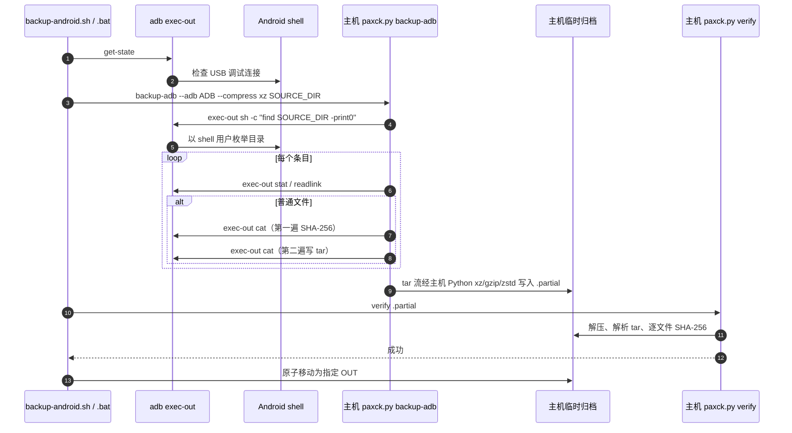
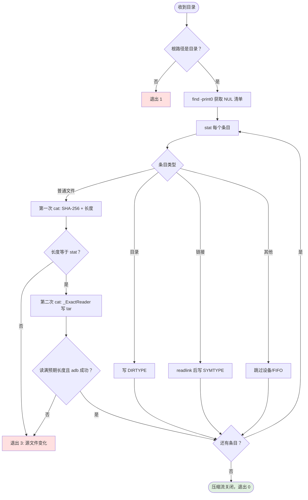

# Android 到主机的流式备份

本项目只使用 ADB 直读，不再包含 Termux、SSH、端口转发或设备端 Python。原因是
Android 11+ 的 scoped storage 会阻止 Termux 等普通应用读取其他应用的
`Android/data/*`，而已授权 USB 调试的 `adb shell` 可读取测试目标。

## 数据流

设备端只会运行不可替代的读取动作：`find -print0` 枚举，`stat` 获取元数据，
`readlink` 读取链接以及 `cat` 把文件内容写进 ADB 通道。不会调用设备端
`tar`、压缩程序或 Python，也不会创建文件。

主机临时文件为 `OUT.partial.<pid>`。它通过校验后才替换 `OUT`；失败时 Linux
脚本会清除它，因此已有的有效备份不会被失败传输覆盖。

## `backup-adb` 的一致性规则

两遍读取避免把整个文件载入内存，也给出明确的一致性语义：任何不能完整读取或在读取中
变更的普通文件都会使本次备份失败，不会被静默跳过。`_ExactReader` 会处理 ADB 管道的
合法短读，只有遇到真正 EOF 才判为文件变短。

## 校验与退出码

`verify` 根据魔术字节识别裸 tar、xz、gzip 和 zstd，并在流式读取 tar 时校验 PAX 扩展头
`PAXCK.checksum.sha256`。

| 退出码 | 含义 |
|---|---|
| `0` | 打包或校验成功 |
| `1` | 参数、ADB 根路径或校验失败 |
| `2` | 缺少 zstd 支持 |
| `3` | 枚举后读取失败、源文件变更或压缩写入中断；输出不可作为备份使用 |

校验器拒绝空归档、损坏/截断的流，以及普通文件全都没有 PAX 哈希的第三方 tar。只有目录
的归档会明确提示“没有做内容校验”，但该情况不适合作为有内容目录的备份结果。

## 平台边界

- ADB shell 的外部存储权限取决于 ROM、设备策略与调试授权。主控先执行 `adb get-state`，
  真机测试会实际读取目标目录。
- `/data/user/*` 等应用私有沙箱仍受 Android UID 隔离保护，不在本项目范围。
- Windows 必须使用 `cmd.exe` 执行 `.bat`。cmd 的重定向按字节写入；PowerShell 会把随机
  二进制流经文本编码转换，可能永久损坏归档。
