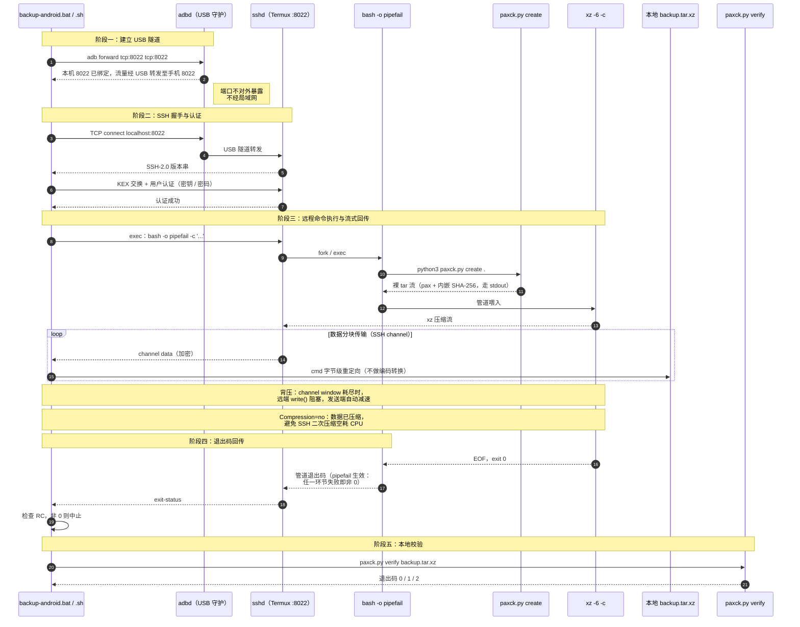
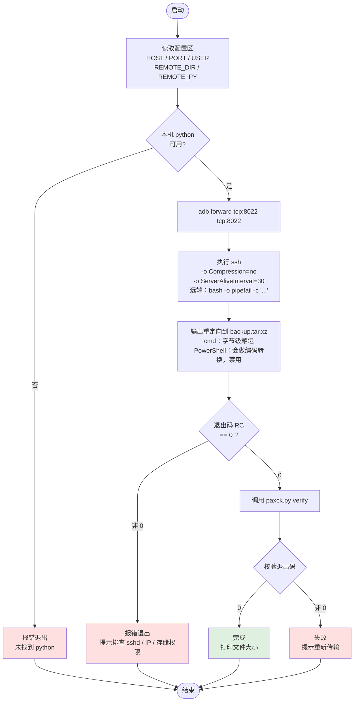
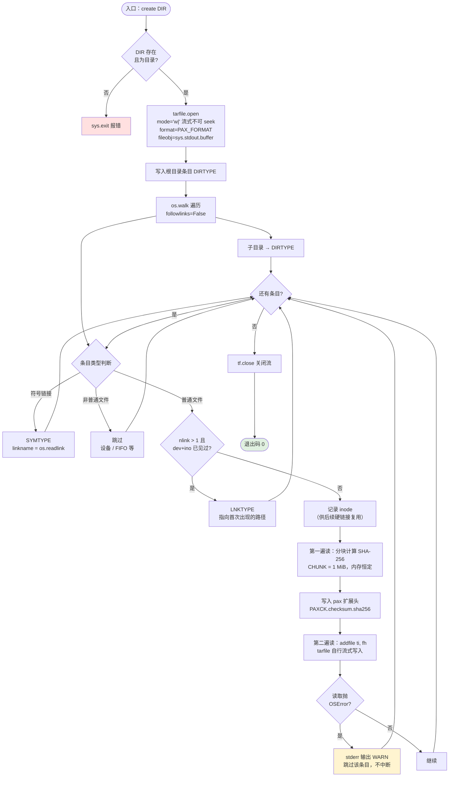
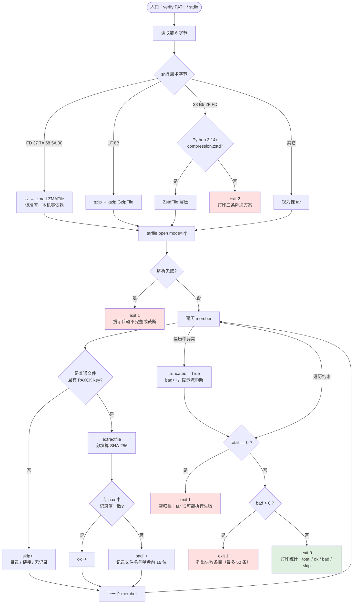

# Android → PC 流式备份系统（开发者视角）

面向开发者，拆解 `paxck.py` 与 `backup-android.bat / .sh` 的内部逻辑，
以及 SSH ↔ sshd 在 USB 转发通道上的通信时序。

---

## 1. 系统分层与通信时序

重点：`adb forward` 建立的是 USB 隧道，SSH 客户端连的是本机 `localhost`，
数据全程不经过局域网；远端 `bash -o pipefail` 是退出码正确性的唯一保障。



**关键时序点**

| 环节 | 说明 |
|---|---|
| `adb forward` | 客户端连 `localhost:8022`，adbd 经 USB 线转发到手机 `8022`，不经网卡 |
| `Compression=no` | 数据已由 xz 压缩，关闭 SSH 层压缩 |
| 背压 | SSH channel window 满 → 远端 `write()` 阻塞 → 管道自然限流，不会撑爆内存 |
| `pipefail` | **无它时：打包失败 + 压缩成功 = 管道返回 0**，空归档被误判为成功 |
| 退出码 | 0 通过 / 1 校验失败 / 2 zstd 无标准库支持 |

---

## 2. `backup-android.bat / .sh` 主控流程



**Windows 端选 cmd 的实测依据**

PowerShell 的 `>` 会把输出按控制台编码（中文 Windows 为 CP936）解码成字符串，
再用 UTF-16LE 编码写文件。实测 1,245,044 字节的压缩流经过该路径后：

```
U+FFFD 替换字符出现 146,694 次 → 写出 1,915,834 字节
```

约 12% 的字节被永久污染，不可恢复。cmd 的重定向是纯字节搬运，绕开该问题。

---

## 3. `paxck.py create` 内部逻辑



**设计取舍**

| 点 | 选择 | 原因 |
|---|---|---|
| 两遍读 | 先算哈希，再 `addfile(ti, fh)` | 避免把整个文件读进内存；实测 50 MB 文件峰值内存仅 8 MB |
| `sys.stdout.buffer` | 二进制安全 | Windows 文本模式会把 `0x0A` 翻译成 `0x0D 0x0A`，损坏二进制流 |
| `surrogateescape` | 路径编解码 | 容忍非 UTF-8 文件名字节 |
| 硬链接去重 | `(st_dev, st_ino)` | 避免重复存储；**沙盒 virtiofs 不支持 `os.link`，此分支未实测** |

---

## 4. `paxck.py verify` 内部逻辑



**三道防线**

1. **流完整性** —— 解析异常 / 截断会被捕获，提示重新传输
2. **条目数 > 0** —— 空归档能通过 `xz -t` 和 `tar -tf`，只有数条目才能发现
3. **每文件 SHA-256** —— 精确定位到损坏的具体文件

实测退出码矩阵：

| 场景 | 退出码 | 输出 |
|---|---|---|
| 正常 | 0 | `共 N 个条目：SHA-256 通过 X，失败 0` |
| 空归档 | 1 | `归档为空（0 个条目）—— tar 很可能执行失败` |
| 传输截断 | 1 | `流在第 N 个条目后中断` |
| 内容损坏 | 1 | `xxx: SHA-256 不符` |
| zstd 输入 | 2 | 三条解决方案 |

---

## 5. 未实测项

- **`.bat` 本体**：沙盒无 Windows cmd，语法靠人工审查
- **Android 硬链接**：沙盒 virtiofs 不支持 `os.link`，`create` 的 LNKTYPE 分支未跑通
- **Windows 上的元信息还原**：pax 可保留亚秒时间戳 / 权限 / 符号链接 / 长路径 / UTF-8 名，
  但 Windows 文件系统不一定能还原这些属性
