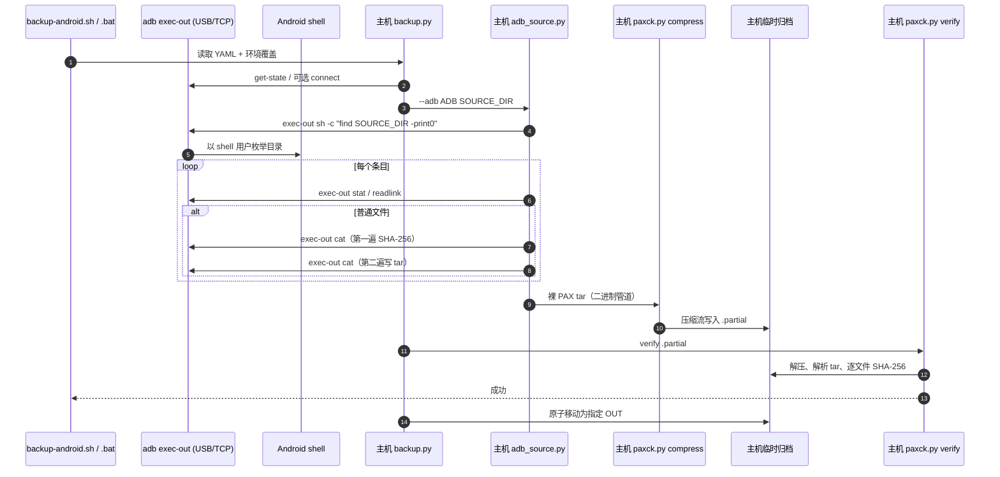
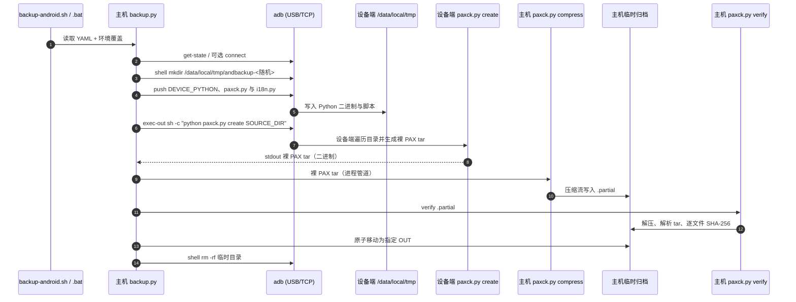
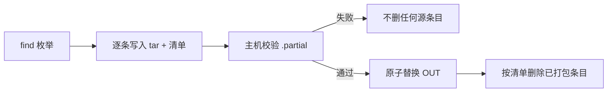

# Android 到主机的流式备份

[English version](flow.en.md) | [中文 README](../README.md)

本项目只使用 ADB 直读，不再包含 Termux、SSH 或端口转发；Android 数据源有两种显式
模式：主机逐条读取（`host-adb`，默认）与上传 Python 后在设备端打包（`device-python`）。
ADB 可以通过 USB 有线链路或 TCP 无线链路承载，两种模式遵循相同的二进制通道约束。
原因是 Android 11+ 的 scoped storage 会阻止 Termux 等普通应用读取其他应用的
`Android/data/*`，而已授权的 ADB shell 可读取测试目标。

## 职责与组合

归档写入与 Android 读取是两个独立层次：

- `paxck.py create <本机目录>` 是通用本机目录打包器；`compress`、`verify` 和 `extract` 可处理
  它产生的裸 PAX tar。校验与提取的实现分别在 `paxverify.py`、`paxextract.py`，由 `paxck.py`
  的 CLI 惰性导入，因此打包器本身不依赖它们（设备端只需 `paxck.py` + `i18n.py`）。
- `adb_source.py pack <Android目录>` 只负责以 `adb exec-out` 枚举/读取设备目录，并把
  条目交给 `paxck.py` 的通用 PAX writer。它的 stdout 是裸 tar，不负责压缩或最终落盘。
  这是 `host-adb` 模式的数据源（`pack` 是它的功能名：它是管道里的数据源阶段）。
- `backup.py` 是 Android 组合入口：读取 `source_mode` 选择数据源，启动数据源与压缩器、
  检查两个子进程的退出码，写入并校验 `OUT.partial.*` 后再原子替换最终输出。`.bat` 和
  `.sh` 仅转发到它。开工前它会用该占位文件预检输出目标（目标不可用、或已存在而未加
  `-f`/`--force` 且无法询问时立即失败，不浪费一次传输）。`source_mode: device-python` 时，
  它上传 `DEVICE_PYTHON` 二进制与 `paxck.py`/`i18n.py` 到设备并在设备端运行 `paxck.py create`。
- 主控的辅助模块（都不被 `paxck.py` 依赖）：`adbdevice.py` 负责 ADB 调用、设备选择与
  exec-out 状态尾标协议；`device_python.py` 负责设备端 Python 环境与远程打包；
  `sourcetree.py` 实现 `tree` 功能（设备端一次性 `find -exec stat` 遍历，失败回退逐条 stat）；`prune.py` 实现 `backup --prune-source` 的清单解析、
  删除计划与执行。

因此 `paxck.py` 可以完全脱离 Android 使用；Android 手动组合为
`adb_source.py pack ... | paxck.py compress xz`，但生产备份应使用 `backup.py` 以得到完整的失败清理
和双端退出码检查。

## 提取模式与公开 CLI

`paxck.py extract` 默认是备份恢复模式：`-C DEST` 的 `DEST` 必须尚不存在；命令先在同级临时
目录中写入，普通文件写入时立即验证 `PAXCK.checksum.sha256`，并拒绝空、重复、绝对、反斜杠、
`.`/`..`、NUL、Windows 驱动器语法、未校验普通文件与不支持的条目。所有内容和压缩流尾部均
成功后才原子改名为 `DEST`。失败时不会发布 `DEST`，也不覆盖已有目录。

`paxck.py extract --direct-tarfile`（`--direct` 为别名）是刻意放宽的互操作模式：它直接调用
Python `tarfile`，可写入已有目录，不校验 PAX SHA-256，不保证原子性，出错可能留下部分文件；
仅可用于可信归档。两个模式的成功信息分别明确标识为“已验证并提取”和“未校验 PAX SHA-256，
非原子”；诊断信息输出到 stderr。

对外命令行接口如下：

| 命令 | 语法 | 输出/语义 |
|---|---|---|
| 本机打包 | `paxck.py create DIRECTORY` | 裸 PAX tar 写到二进制 stdout。 |
| 压缩 | `paxck.py compress {xz,gzip,zstd,none}` | 二进制 stdin 到二进制 stdout。 |
| 校验 | `paxck.py verify [ARCHIVE]` 或 `-i ARCHIVE`，可加 `-q` | 自动识别压缩，校验普通文件的 PAX SHA-256。 |
| 提取 | `paxck.py extract [ARCHIVE] -C DEST` 或 `-i ARCHIVE` | 默认已验证、暂存、原子发布；可加 `--direct-tarfile` 改为可信归档直接模式。 |
| Android 数据源 | `adb_source.py pack [--adb ADB] DIRECTORY` | 设备目录写为 stdout 裸 PAX tar。 |
| Android 主控 | `backup.py backup [--config PATH]`、`backup.py tree [--tree-out PATH] [--tree-mode …]`、`backup.py clean [目标]` | 读取 YAML/环境，完成 ADB 管道、校验和原子输出；`tree` 只输出源目录详细信息树（模式、属主/组、大小、时间、符号链接目标，默认设备端一次性遍历，失败回退逐条 stat）；`clean` 只删缓存。 |
| 平台包装 | `backup-android.sh [ARGS...]` / `backup-android.bat [ARGS...]` | 将参数转发给同目录 `backup.py`。 |

三个 Python 入口都支持 `--version`。`backup.py` 识别 YAML 键 `adb`、`host`、`serial`、
`source_dir`、`out`、`compress`、`log_level`、`progress_interval`，并由同名环境变量覆盖（旧键
`device_id`/`device`/`adb_serial` 视为 `serial` 的别名）；配置选择顺序为
`--config`、`BACKUP_CONFIG_FILE`、存在的同目录 `backup-android.yaml`（前两者及 YAML 里的
`out`/`device_python` 等相对路径都以**启动进程的工作目录**为基准；只有这个默认配置文件
按 `backup.py` 所在目录查找）。应从
`backup-android.example.yaml` 复制并编辑本地 YAML；实际 YAML 已忽略，不能提交端点或本机路径。
未列出的 Python 函数、类和常量均为实现细节，不是稳定公开 API。

`log_level` 可设为 `quiet`、`error`、`warn`、`info`、`debug` 或 `trace`；`progress_interval`
指定进度输出的最小间隔秒数（至少 `0.1`）。进度和累计 ADB 流量只写入 stderr/状态文本，
不会进入 tar 数据流。`quiet` 仍保留错误信息，适合自动化；`info`（默认）显示条目计数、
累计读取字节和定期传输状态，`debug`/`trace` 提供更详细的当前条目诊断。`show_rate: true`
或 `--show-rate` 会在定期状态中增加每秒有效载荷速率；它默认关闭。

## 数据流



上面的时序图是 `host-adb` 模式。该模式设备端只会运行不可替代的读取动作：
`find -print0` 枚举，`stat` 获取元数据，`readlink` 读取链接以及 `cat` 把文件内容写进
ADB 通道。不会调用设备端 `tar`、压缩程序或 Python，也不会创建文件。

### `device-python` 模式

`source_mode: device-python` 把打包环节也放到设备端，但复用同一个 `paxck.py create`
通用写入器，因此仍保留 PAX SHA-256 与两遍读取语义；压缩与最终校验仍在主机完成。



- 设备端只临时写入 `DEVICE_PYTHON`（单文件解释器，或含 `bin/`+`lib/` 的 prefix
  目录——目录会被主机打包为一个 tar 上传并在设备端解压，使解释器能找到其标准库）与
  `paxck.py`，不生成 tar 文件或压缩包；运行结束由主控 `rm -rf` 清理。
  设备端脚本与其文案目录（`paxck.py` + `i18n.py`）一起上传，`stamp` 覆盖两者的
  SHA-256，所以升级任一文件都会使旧缓存失效并重新上传。
- 设备端 `paxck.py create` 的 stdout 是唯一数据通道；诊断写到设备端 stderr 文件，主控
  在结束后读回并转交主机 stderr。
- 主机在接收 tar 流时统计已接收字节并可按 `progress_interval`/`show_rate` 显示进度与
  速率（写 stderr，不进入归档字节）。
- 该模式需要用户提供与设备 ABI/linker 兼容的 Android ARM64 Python（常见做法是
  python-build-standalone 等静态 musl aarch64 构建，`DEVICE_PYTHON` 指定其单文件或
  prefix 目录）；解释器缺失、无法执行或打包失败都是硬错误，不会自动回退到
  `host-adb`。解释器不随仓库分发：可设 `download_device_python: true`，脚本会从
  python-build-standalone 固定 Release（`device_python_url` 可覆盖，也可为本地
  `.tar.zst` 离线复用）下载并解压到 `DEVICE_PYTHON` 或默认缓存；解压仅用标准库 /
  外部 `zstd` / 系统 `tar`，不引入第三方 Python 包。

## USB 与无线 ADB

两种连接方式只改变 ADB 客户端到设备 adbd 的传输链路，不改变设备端 shell 命令、
`exec-out` 的二进制语义、双遍读取校验或主机端 tar/压缩流程。

| 连接方式 | 设备选择 | 连接准备 | YAML 关键设置 |
|---|---|---|---|
| USB 有线 | `adb devices` 第一列的序列号；单设备可不指定 | 打开 USB 调试、接线并在设备上授权主机 | `host: ""`、`serial: ""`（自动）或 `serial: <USB serial>` |
| TCP 无线 | `host`（`IP` 或 `IP:port`） | 先 `adb pair host:pair-port`，再使用无线调试页显示的连接端口 | `host: <IP:port>`（可再配 `serial`） |

`host` 非空时主控先执行 `adb connect`，随后按 `adb devices` 与 `host` 匹配（相同，或 `IP:`
前缀，兼容只填 IP）；`serial` 非空时固定该 ADB 序列号（等价 `adb -s SERIAL`，USB serial 或
mDNS ID，仅当序列号重复时才需要 `-t` 传输 ID），不触发
`adb connect`。两者都为空则枚举 `adb devices`：恰一台在线设备直接使用；多台在交互终端列出
选择，非交互则报错。

数据通道必须保持为 `adb exec-out -> Python subprocess.PIPE -> Python binary stdout`。不能用
`adb shell ... > file` 或把 `exec-out` 接到 PowerShell 的文本管道；前者可能分配终端，后者会
按文本编码处理数据。Windows 的 `.bat` 重定向的是 Python 的二进制 stdout，`0x0A` 保持原样。

### ADB 错误流与权限错误

部分 Windows `adb.exe` 版本/传输模式会把 Android shell 的 stderr 混入 `exec-out` stdout。
适配器在设备端丢弃 stderr，并在每条命令末尾附加内部 NUL 状态标记，再在主机移除该标记，
因此诊断文本不会污染路径清单或文件字节流。目录遍历遇到 scoped storage、权限或 shell UID
限制时，适配器输出 `[WARN]`、跳过不可读取条目，归档**仍会照常校验并发布**；只有完全无法
枚举、没有任何可归档条目时才不生成文件。根目录错误、协议损坏、压缩失败或文件两遍读取
不一致仍为硬失败。这与常见 tar 的“尽量归档、尽量发布”语义一致。

主机临时文件为 `OUT.partial.<unique>`。它通过校验后才替换 `OUT`；失败时 Linux 与
Windows 脚本都会清除它，因此已有的有效备份不会被失败传输覆盖，并发运行也不会互删临时
文件。

### 打包清单与 `--prune-source`

打包端（`adb_source.py`，或 `device-python` 模式下设备端的 `paxck.py create`）在写归档的
同时把每个条目的处理结果写成一份 NUL 分隔清单：`P:<path>` 已打包的非目录条目、
`D:<path>` 已打包目录、`S:<path>` 列到但未打包（被跳过）、`L:<code>` 本次枚举不完整。
主控只在 `--prune-source` 时请求该清单（`--packed-manifest PATH`），并在归档**校验通过且
原子替换成功之后**才使用它：



删除规则刻意保守：只有 `P`/`D` 记录在源根目录之下的条目才可能被删除；任何 `S` 记录及其
祖先目录都保留；出现 `L`（枚举不完整）时只删 `P`（普通文件与符号链接），全部目录保留。
执行时先删文件（`rm -f`），再删空目录（`rmdir`，不是 `rm -rf`——枚举之后新写入的文件会让
目录保留而不是被递归删除）。

## `adb_source.py` 的一致性规则


两遍读取避免把整个文件载入内存，也给出明确的一致性语义：任何不能完整读取或在读取中
变更的普通文件都会使本次备份失败，不会被静默跳过。`_ExactReader` 会处理 ADB 管道的
合法短读，只有遇到真正 EOF 才判为文件变短。

## Tar 元信息

归档使用 Python `tarfile` 的 POSIX PAX 格式（`PAX_FORMAT`）。下表描述工具实际写入的
字段；“默认 0”指 `TarInfo` 的默认值，不是从源文件读取到的值。

| 字段 | 普通文件 | 目录 | 符号链接 | 硬链接（仅本机目录） |
|---|---|---|---|---|
| `name` | 归档路径 | 归档路径 | 归档路径 | 归档路径 |
| `type` | `REGTYPE` | `DIRTYPE` | `SYMTYPE` | `LNKTYPE` |
| `mode` | 源权限位 | 源权限位 | 源权限位 | 源权限位 |
| `mtime` | 源修改时间 | 源修改时间 | 源修改时间 | 源修改时间 |
| `size` | 实际读取字节数 | 0 | 0 | 0 |
| `uid` / `gid` | 本机源文件的 UID/GID；ADB 模式为默认 0 | 默认 0 | 默认 0 | 本机源文件的 UID/GID |
| `linkname` | 空 | 空 | 源链接目标 | 首次出现的同 inode 归档路径 |
| `PAXCK.checksum.sha256` | 内容 SHA-256 | 无 | 无 | 无 |

补充说明：

- 所有条目的 tar 头部校验和由 `tarfile` 自动生成；它不是源文件元信息。
- 本机路径使用 `/` 作为 tar 条目分隔符；文件名使用文件系统编码和
  `surrogateescape`，ADB 路径使用 UTF-8/`surrogateescape` 解码。PAX 会按需承载长路径、
  非 ASCII 名称和非整数时间等扩展表示。
- 普通文件的 `size` 是第一遍 ADB/本机读取实际得到的长度，并与 `stat`/`lstat` 的大小比较；
  两遍读取不一致时整次备份失败。
- 本机目录模式会检测同一 `(st_dev, st_ino)` 的第二次出现并写成硬链接；ADB 模式没有设备
  inode 信息，不生成硬链接条目，每个普通文件都按独立文件读取。
- 本机根目录、子目录和符号链接的 UID/GID 没有赋值，因此保持 `TarInfo` 默认 0；ADB
  `stat` 当前只读取类型、权限、大小和修改时间，也不会恢复 Android UID/GID。

以下信息当前不会写入归档：用户名/组名（`uname`/`gname`）、访问时间（`atime`）、状态
改变时间（`ctime`）、创建时间、inode、设备号、xattr、ACL、Linux file flags、SELinux
标签以及目录时间之外的目录内容属性。FIFO、Unix socket、设备节点等非普通文件也不会生成
条目；程序只保留目录、普通文件、符号链接和（本机模式的）硬链接。

### 时间精度与 Android 元数据来源

- 本机目录模式把 Python `os.lstat()` 返回的 `st_mtime` 传给 `TarInfo.mtime`。PAX 格式
  能保存小数秒；最终可用精度取决于本机文件系统/操作系统提供的时间戳以及 Python 浮点
  表示，不承诺固定的纳秒精度。
- ADB 目录模式执行 Android `stat -c '%f|%s|%Y|%y|%a'`。`%Y` 提供自 Unix epoch 起的
  整数秒基准，`%y` 提供带小数部分的可读时间；主机从 `%y` 提取小数并合并回 `%Y`。
  因此归档不再主动截断到整秒，但最终精度仍由设备实际暴露的时间戳、Python 浮点和 PAX
  表示共同决定。
- 当前实测设备的 `/storage/emulated/0/Android/data/...` 中，文件和目录的 `%y` 均出现
  9 位小数（例如 `...17.181008465 +0800`），说明该挂载至少通过 `stat` 暴露了纳秒格式
  的值。小数位数不等于所有设备都保证纳秒写入精度；不同 ROM、FUSE/媒体存储实现和文件
  系统仍可能量化到微秒、毫秒或整秒。
- 可针对具体路径直接检查：

  ```sh
  adb shell "stat -c '%y|%Y' -- /storage/emulated/0/path/to/file"
  ```

  `%y` 的小数位是当前接口返回的可观察精度；要验证实际写入量化，还应对测试文件设置
  不同的亚秒 `mtime` 后重新读取并比较（在临时目录中操作，避免改动用户数据）。
- 当前实现没有请求 `atime`、`ctime`、创建时间（birth time）、inode、UID/GID、用户名或
  组名。因而这些字段缺失首先是项目归档格式的明确取舍，而不是声称 Android 一定没有
  这些字段；即使设备能返回它们，当前版本也不会写入。
- Android 上的 `adb shell` 通常以 `shell` UID 运行。Android scoped storage、Unix 权限、
  `/storage` 的 FUSE/媒体存储抽象以及不同文件系统的能力，可能使某些目录的创建/访问/
  状态改变时间或 UID/GID 查询被拒绝、被合成或不稳定；应用私有目录尤其如此。遇到这种
  情况是 Android 的权限/存储边界，不是本项目主动抹除元数据，但本项目仍必须至少读到
  类型、权限、大小和 `mtime` 才能生成当前归档。
- 因此，若用户需要纳秒级修改时间、访问/创建时间或 Android UID/GID，应先确认目标目录
  在当前 ROM、挂载方式和授权级别下能由 `adb shell stat` 读取，再扩展协议和 PAX 字段；
  不能仅靠更换 tar 压缩格式恢复设备端未提供或当前未采集的字段。

## 发布依赖与版本策略

生产路径只需要 Python 标准库和主机上的 Android SDK Platform-Tools `adb`。源码没有导入
PyYAML、`zstandard` 或其他第三方 Python 包，因此不需要 `requirements.txt` 或虚拟环境来
安装运行依赖。

Python 3.12+ 是当前最低支持版本，覆盖 tar/PAX、ADB、xz、gzip、裸 tar 和内置 YAML 子集
解析。zstd 有两条路径：Python 3.14+ 使用标准库 `compression.zstd`；Python 3.12--3.13
需要主机 `PATH` 中的 `zstd` 命令。发布时建议在 CI 测试 Python 3.12、3.13、3.14，而不是
强制所有用户使用同一个补丁版本。只有需要可复现的 zstd 压缩字节时，才需要同时固定 Python
和 zstd 版本；归档逻辑和校验结果不依赖补丁版本。

发布准备期间已完整运行 Windows CPython 3.13.15 离线套件，并在 WSL Ubuntu CPython 3.14.4
运行跨平台选择用例。Python 3.12 未在本机额外安装，但会由 CI 覆盖。Ubuntu 24.04 的系统
Python 为 3.12；Debian 12 的系统 Python 为 3.11，使用 Debian 12 时须自行提供 3.12+。

`adb` 是外部的 Android 调试工具，不是 Python 依赖。`host-adb` 模式设备端只使用 ROM
提供的 `find`、`stat`、`readlink` 和 `cat`，不需要安装 Python、tar 或压缩程序；
`device-python` 模式需要用户提供 Android ARM64 Python 二进制（`DEVICE_PYTHON`）。

## 与设备端 tar 的效果差异

除了上面的 `host-adb`，还可以把 tar 二进制和压缩程序上传到 Android `/data/local/tmp/`，
让设备端 tar 遍历目录并把结果流回主机。本项目的 `device-python` 是这条思路的受控实现：
它上传的是 Python 解释器与 `paxck.py`，因此**仍复用同一个 PAX writer**，保留两遍读取与
PAX SHA-256 语义；而上传独立 tar 二进制则通常没有这些保证。下表对比三者：

| 维度 | `host-adb`：主机生成 tar | `device-python`：设备端 Python 生成 tar | 备选：上传独立 tar 二进制 |
|---|---|---|---|
| 实现与版本 | 主机 Python `tarfile` + 主机压缩器 | 设备端 Python `tarfile`（`paxck.py`）+ 主机压缩器 | 设备端 tar/压缩器版本与参数 |
| 设备资源 | 只读命令和 ADB 通道，不上传可执行文件 | 上传 Python 二进制与 `paxck.py`，运行后清理 | 需要架构、linker、SELinux 和执行权限兼容 |
| 普通文件 | 两遍读取，写入 PAX SHA-256，变化则失败 | 两遍读取，写入 PAX SHA-256，变化则失败 | 通常一遍读取，无同等校验语义 |
| 硬链接 | ADB 模式不恢复 inode 关系 | 由设备端 `paxck.py create` 按本机逻辑处理 inode | 可能保留，取决于 tar |
| 特殊文件 | FIFO/socket/设备节点跳过 | 与 `paxck.py create` 一致，跳过 | 可能记录或尝试读取 |
| UID/GID 与扩展属性 | ADB UID/GID 默认值，不保存 xattr/ACL/SELinux | 取决于设备端 `paxck.py` 能读到的 lstat 字段 | 可能保留，取决于权限与参数 |
| 字节级结果 | 条目顺序、PAX 头和压缩参数由主机固定 | 条目顺序由设备端 `os.walk` 决定，压缩参数由主机固定 | 由 Android tar 实现决定，通常不同 |

因此，“解压后文件内容相同”是可实现的目标，“tar 文件逐字节相同”不是自然结果。若需要
跨实现比较，应比较解压后的路径、类型、内容哈希和明确选定的元信息集合，而不是直接比较
归档文件的 SHA-256。

## 校验与退出码

`verify` 根据魔术字节识别裸 tar、xz、gzip 和 zstd，并在流式读取 tar 时校验 PAX 扩展头
`PAXCK.checksum.sha256`。

| 退出码 | 含义 |
|---|---|
| `0` | 打包或校验成功 |
| `1` | 参数、ADB 根路径或校验失败；也包括输出目标写不进去（目录/特殊文件/只读或占用）或已存在而未获同意覆写（无 `-f`/`--force` 且无法询问） |
| `2` | 缺少 zstd 支持 |
| `3` | 打包期间源文件变更、压缩/写入中断等无法恢复的 I/O 失败；结果不能视为备份。条目不可读只会 `[WARN]` 跳过并继续（仅当完全无法枚举时才不生成文件） |

校验器拒绝空归档、损坏/截断的流，以及普通文件全都没有 PAX 哈希的第三方 tar。只有目录
的归档会明确提示“没有做内容校验”，但该情况不适合作为有内容目录的备份结果。

## 平台边界

- ADB shell 的外部存储权限取决于 ROM、设备策略与调试授权。主控先执行 `adb get-state`，
  真机测试会实际读取目标目录。USB 设备可省略 `serial`（单设备）或填写
  `adb devices` 的 USB 序列号；无线设备填写 `host=IP:port`，再设
  `serial=IP:port` 并启用 `ADB_CONNECT=1` 会在检查前运行 `adb connect`。脚本将 serial 导出为 `ANDROID_SERIAL`，
  所以主机 Python 后续启动的每一个 `adb exec-out` 也会指向同一设备。
- `/data/user/*` 等应用私有沙箱仍受 Android UID 隔离保护，不在本项目范围。
- **`Android/data/<pkg>` 的可备份能力完全取决于其他应用创建文件时给出的权限。**
  `/storage/emulated/0` 由 FUSE 提供，目录项的属主是“通过该路径创建条目的 UID”。
  `adb shell`（uid 2000）能否读取，只取决于该条目对 `ext_data_rw` 组或 `other` 是否可读：
  同一个 QQ 目录下，QQ 自己写的文件属主是 `u0_a183`（uid `10183`）且通常 `0777`/`0666`
  （实测 `-0766`，`other` 可读），可以读；
  而由外部文档服务（如荣耀文档 Honor Docs Service，`u0_a203`，uid `10203`）另存进去的文件是
  `-rw-rw---- u0_a203:u0_a203`（umask `0660`），shell 既非属主也不在其组内，只能被
  `[WARN]` 跳过（实测某 QQ 接收目录 1259 个条目中 81 个属于此类）。目录同理：应用自带临时目录（如 `.TbsReaderTemp`，`drwxrwx---`，
  组为该应用自身）连进入都不允许。这不是本工具能解决的问题，且与息屏等状态无关；
  可行办法是在设备上用能访问它的应用“另存/分享”到 `/sdcard/Download/` 等 shell 可读位置，
  再用 `backup.py tree` 确认可读性（树里的属主/组是数字 UID/GID）。
- Windows 必须使用 `cmd.exe` 执行 `.bat`。cmd 的重定向按字节写入；PowerShell 会把随机
  二进制流经文本编码转换，可能永久损坏归档。
