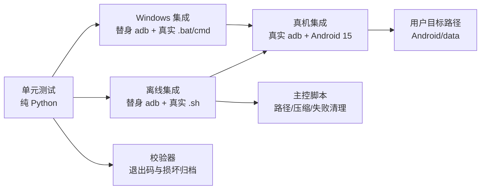

# 测试说明

测试分为四层：不依赖设备的 Python 单元测试、替身 ADB 驱动的 Linux 主控集成测试、替身
ADB 驱动的 Windows/CMD 主控集成测试，以及连接 Android 设备后的真机集成测试。

## 运行

```sh
# Linux/macOS：标准库即可
python3 -m unittest discover -s tests -t . -v

# 可选 pytest
python3 -m pytest tests -q
```

Windows 在已安装 Python 3 后，从 `cmd.exe` 运行：

```bat
py -m unittest discover -s tests -t . -v
```

真机测试会自动查找 `adb`；也可指定：

```sh
ANDROBACKUP_ADB=/path/to/platform-tools/adb \
python3 -m unittest -v tests.test_device_integration
```

无线调试可显式选定设备；`ANDROBACKUP_ADB_CONNECT=1` 才会在测试开始时发起连接：

```bat
set "ANDROBACKUP_ADB_SERIAL=192.0.2.1:5555"
set "ANDROBACKUP_ADB_CONNECT=1"
py -m unittest -v tests.test_device_integration
```

Windows 与 Linux 主控的现场变量集中在 UTF-8 `src/backup-android.yaml`；无线调试端点更新
时只改其中的 `adb_serial` 行。离线测试通过 `BACKUP_CONFIG_FILE` 指向不存在的文件来隔离
现场配置。`.bat` 与 `.sh` 只是调用同一个 `backup.py` 的薄包装。

没有已授权设备时，真机测试会 `skip`，不会使离线 CI 失败。

## 覆盖矩阵



| 文件 | 类型 | 重点 |
|---|---|---|
| `tests/test_paxck_unit.py` | 单元 | 魔术字节、流读取器、PAX 哈希、符号链接、硬链接、变化文件、压缩和校验退出码 |
| `tests/test_pipeline_local.py` | 离线集成 | `create | compress | verify`、系统 tar 互操作、还原保真、非 UTF-8 文件名 |
| `tests/test_backup_sh_integration.py` | 离线集成 | 真实 `.sh` + 替身 ADB；中文/空格/单引号路径、二进制安全、截断、错误退出、Android/data 路径 |
| `tests/test_backup_bat_integration.py` | Windows 离线集成 | 真实 `cmd.exe` + `.bat` + `.cmd` 替身 ADB；UTF-8 路径、二进制重定向、gzip/裸 tar、TCP serial、失败清理 |
| `tests/test_device_integration.py` | 真机集成 | ADB 授权、目标目录读取、双遍字节一致性、平台对应主控备份、设备空间不生成中间文件 |

## 单元测试要点

`TestConfig` 覆盖 UTF-8 YAML 的引号、布尔值、行尾注释和格式错误；同一解析器由 Windows
和 POSIX 主控共享。

`paxck.py create` 的样例树包含普通文件、空文件、跨 1 MiB 边界的大文件、中文和空格名、
指向文件/目录的符号链接、断链以及 FIFO。测试确认：

- PAX 扩展头中的 SHA-256 与归档内容一致。
- 指向目录的符号链接保持 `SYMTYPE`，不会被 `os.walk` 错写成空目录。
- 文件在两遍读取间被删除、缩短或权限改变时不会产出“成功”的坏归档。
- ADB/管道的合法短读不会被误判为 EOF。
- 归档缺条目、截断、内容翻转或没有任何 SHA-256 记录时，`verify` 返回 1。

## 离线主控集成

替身 ADB 在本机临时目录上实现 `get-state` 与 `exec-out sh -c ...`，真实执行 find/stat/
readlink/cat。这样不依赖手机，也能验证：

- 脚本不再 `adb push`、`adb forward`，设备上没有代码或归档暂存。
- 目录名含中文、空格、单引号时仍可正确读取。
- xz、gzip、none 三种模式都能生成并验证归档。
- ADB 不可用、源路径不存在/不是目录、ADB 输出截断时脚本失败。
- 输出先写 `.partial`，校验成功后才移动到最终文件。

Windows 用例会由 Python 真正启动 `cmd.exe /d /c backup-android.bat`，而不是模拟批处理
语法。替身 ADB 本身是一个 `.cmd` 文件，继续转交给 Python，以覆盖 Windows 的命令行参数
传递、`cmd` 的二进制重定向、`%ERRORLEVEL%` 分支，以及 `.partial.<random>` 清理。该层还
验证 `ADB_SERIAL` 被映射为子进程可见的 `ANDROID_SERIAL`，并在 `ADB_CONNECT=1` 时先执行
`adb connect`。样例文件含有从 `0x00` 到 `0xff` 的全部字节，专门覆盖 LF 不得变为 CRLF 的
回归风险。

## 真机测试

真机测试默认目标是 `/storage/emulated/0/Android/data/com.example.backup/测试.d`，可用
`ANDROBACKUP_DEVICE_DIR` 覆盖。测试不上传被测数据，只通过 `adb exec-out` 读取。

重点用例：

1. 目标目录存在且可由 ADB shell 列出。
2. 文件两次 `exec-out cat` 与 `adb pull` 逐字节一致。
3. 真实 `backup-android.sh` 输出可由本机 `verify` 完整校验。
4. 归档中的 `测试.txt` 与设备源字节一致。
5. 备份前后设备可用空间变化小于 32 MiB，防止未来回退为设备端中转文件。
6. 对含 LF 的真实设备文件，Windows `adb exec-out cat` 与 `adb pull` 的字节完全一致。

设备未连接、未授权或路径不可读时应先修复 ADB 权限；测试失败不会自动改写设备内容。无线
设备可通过 `ANDROBACKUP_ADB_SERIAL=host:port` 选择，连接动作只在同时设定
`ANDROBACKUP_ADB_CONNECT=1` 时执行。
