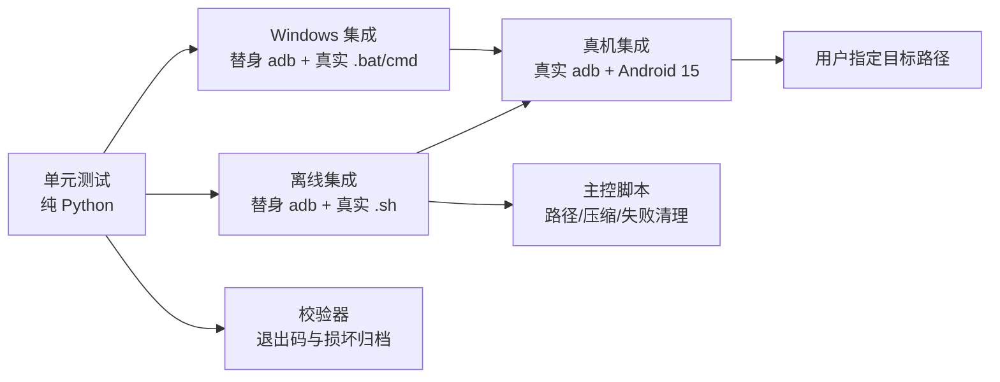

# 测试说明

[English version](testing.en.md) | [中文 README](../README.md)

测试分为四层：不依赖设备的 Python 单元测试（包括通用 PAX writer 与 ADB 源适配器）、替身
ADB 驱动的 Linux 主控集成测试、替身 ADB 驱动的 Windows/CMD 主控集成测试，以及连接 Android
设备后的真机集成测试。

## 运行

```sh
# Linux/macOS：标准库即可
python3 -m unittest discover -s tests -t . -v

# 可选 pytest
python3 -m pytest tests -q
```

Windows 在已安装 Python 3 后，从 `cmd.exe` 运行：

```bat
py -m unittest discover -s tests -t . -v
```

真机测试会自动查找 `adb`，但必须显式填写一个可读取的 Android 目录，避免仓库假设现场路径；也可指定
`adb`：

```sh
ANDROBACKUP_ADB=/path/to/platform-tools/adb \
ANDROBACKUP_DEVICE_DIR=/storage/emulated/0/DCIM \
python3 -m unittest -v tests.test_device_integration
```

真机测试同时支持两种 ADB 传输。USB 有线设备（单设备）不设置选择变量：

```sh
unset ANDROBACKUP_ADB_SERIAL ANDROBACKUP_ADB_CONNECT
export ANDROBACKUP_DEVICE_DIR=/storage/emulated/0/DCIM
python3 -m unittest -v tests.test_device_integration
```

多台设备/连接同时存在时，建议将 `ANDROBACKUP_ADB_SERIAL` 设为 `adb devices` 输出的目标
serial；测试会用 `adb -s <serial>`，但不会执行 `adb connect`。未设置时，测试会选取第一台已
授权设备并在本次运行中固定该 serial，避免后续命令触发 `more than one device/emulator`。无线
设备则使用 `host:port`；
`ANDROBACKUP_ADB_CONNECT=1` 才会在测试开始时发起连接：

```sh
export ANDROBACKUP_ADB_SERIAL=192.0.2.1:5555
export ANDROBACKUP_ADB_CONNECT=1
export ANDROBACKUP_DEVICE_DIR=/storage/emulated/0/DCIM
python3 -m unittest -v tests.test_device_integration
```

Windows CMD 下的等价用法：

```bat
rem USB 单设备：清空两个变量
set "ANDROBACKUP_ADB_SERIAL="
set "ANDROBACKUP_ADB_CONNECT="
set "ANDROBACKUP_DEVICE_DIR=/storage/emulated/0/DCIM"
py -m unittest -v tests.test_device_integration

rem 无线：先完成 adb pair，再填写无线连接端点
set "ANDROBACKUP_ADB_SERIAL=192.0.2.1:5555"
set "ANDROBACKUP_ADB_CONNECT=1"
set "ANDROBACKUP_DEVICE_DIR=/storage/emulated/0/DCIM"
py -m unittest -v tests.test_device_integration
```

Windows 与 Linux 主控的本地现场变量应先从 UTF-8 `src/backup-android.example.yaml` 复制为
`src/backup-android.yaml`；后者已忽略，无线调试端点更新时只改其中的 `host`（或 `serial`）行。也可以在
包装命令后追加 `--config PATH` 选择任意位置的 YAML，
其优先级高于 `BACKUP_CONFIG_FILE` 和默认文件。离线测试通过将 `BACKUP_CONFIG_FILE` 指向不存在
的文件来隔离现场配置。`.bat` 与 `.sh` 只是调用同一个 `backup.py` 的薄包装。

没有已授权设备时，真机测试会 `skip`，不会使离线 CI 失败。

## 覆盖矩阵



| 文件 | 类型 | 重点 |
|---|---|---|
| `tests/test_paxck_unit.py` | 单元 | 通用 PAX writer、魔术字节、流读取器、PAX 哈希、符号链接、硬链接、变化文件、压缩、校验/提取退出码、默认安全提取与 `tarfile` 直接提取，以及 `adb_source` 的 Android `%Y/%y` 元数据解析 |
| `tests/test_android_python.py` | 单元 | `device-python` 解释器引导：已有路径/缓存复用（不联网）、缺失报错、本地 `.tar.zst` 下载+解压（含离线 fixture），覆盖 stdlib `compression.zstd`/外部 `zstd`/系统 `tar` 三种解压路径 |
| `tests/test_pipeline_local.py` | 离线集成 | 独立本机 `create | compress | verify`、系统 tar 互操作、还原保真、非 UTF-8 文件名 |
| `tests/test_backup_out_unit.py` | 单元 | `OUT` 规划（空/目录/尾分隔符/后缀匹配与不符）与输出目标预检：目标缺失/已存在普通文件为可用，已存在目录、FIFO/特殊文件不可用，Windows 上只读文件不可用而 POSIX 可行；已存在目标默认不覆写（提示 `--force`）、`force` 直接通过，`--force` 不绕过真写不进去的目标；`publish_archive` 成功替换、失败时保留已校验的 `.partial.*`；`_choose_output_path` 生成占位文件、自动创建父目录、交互 `y`/`n`（改输新路径）/回车放弃/EOF（Windows 把 NUL stdin 当 TTY）各路径正确且不留残骸；`_enabled` 与 YAML `force:` 映射 |
| `tests/test_backup_sh_integration.py` | 离线集成 | 真实 `.sh` + 替身 ADB；`backup.py -> adb_source.py -> paxck.py` 组合、USB serial（不 connect）与 TCP serial（connect）、中文/空格/单引号路径、二进制安全、截断条目只 WARN 跳过且照常发布、`--prune-source`（无权限条目与源根目录保留、`--prune-dry-run` 不删除）、错误退出、`--list-tree`（含符号链接目标与 `--tree-out`）、Android/data 路径、输出目标预检（路径某段是文件、父目录不可写时报错且不产生任何 adb 调用） |
| `tests/test_backup_bat_integration.py` | Windows 离线集成 | 真实 `cmd.exe` + `.bat` + `.cmd` 替身 ADB；`backup.py -> adb_source.py -> paxck.py` 组合、USB serial（不 connect）与 TCP serial（connect）、UTF-8 路径、二进制重定向、gzip/裸 tar、失败清理、命令行 YAML 路径、`--list-tree`、`--prune-source`（只删已打包条目、跳过的保留、演练、`--prune-dry-run` 需与 `--prune-source` 同用、device-python 走远端清单）、`device-python` 上传/回读/清理、缺少 `DEVICE_PYTHON` 报错与不自动回退，以及输出目标预检（只读的已存在目标、路径某段是文件时立即失败，不产生任何 adb 调用且原文件字节不变）与已存在目标的处理（无 `-f` 保留原文件并报错退出，带 `-f` 覆写且归档可校验） |
| `tests/test_device_integration.py` | 真机集成 | ADB 授权、目标目录读取、双遍字节一致性、平台对应主控备份、设备空间不生成中间文件 |
| `tests/test_i18n_unit.py` | 单元 | 目录表：两种语言的 key 集合与占位符一致、每个模板都能格式化、未知 key 回退、标签语言无关、源码里 `i18n.t()` 用到的 key 全部存在、命令模块中不再残留中文字面量；语言选择：`normalize`/`resolve` 优先级与回退、OS 语言优先于进程区域（Windows UI 语言）、`--lang` 解析、`--help` 本地化、非法 `--lang` 报错；`i18n.os_error` 优先用本工具译文（未知 errno 才保留系统文本）；`i18n.can_prompt`（`quiet`/`error`、非 TTY、stdin 为 `None`、Windows 上 NUL/DEVNULL 不算可交互） |
| `tests/test_prune_unit.py` | 单元 | 打包清单解析（`P`/`D`/`S`/`L`、非 UTF-8 路径、空/未知记录）与删除计划：由深到浅、跳过条目及其父目录保留、枚举不完整时保留全部目录、源根目录永不删除、源根之外的路径拒绝、同前缀兄弟目录不算子项；命令构造只用 `rm -f`/`rmdir` 并正确引用 |

## 单元测试要点

`TestConfig` 覆盖 UTF-8 YAML 的引号、布尔值、行尾注释和格式错误；同一解析器由 Windows
和 POSIX 主控共享。

`TestAdbSourceMetadata` 用 toybox 风格的 `%Y`/`%y` 输出验证 `adb_source.py` 保留 Android
亚秒 `mtime`，并直接验证其目录、普通文件和符号链接均经通用 PAX writer 写入，避免回归为
只读取整数秒或把 ADB 打包逻辑重新耦合回 `paxck.py`。

目录树（`--list-tree`）的离线覆盖在两个主控集成套件里：替身 ADB 会按请求的 `stat -c`
格式返回 `%u`/`%g`（Windows 替身用 `st_uid`/`st_gid`，通常为 0），测试断言模式位、
属主/组、缩进层级、符号链接目标、`--tree-out` 写文件，以及不产生归档文件。

发布验证应在 Python 3.12、3.13 和 3.14 至少各运行一次离线测试：3.12/3.13 的 zstd
用例需要 PATH 中的 `zstd`，3.14 可验证标准库 `compression.zstd` 路径。xz、gzip 和裸 tar
不需要任何第三方 Python 包。

当前本地实际验证版本为 Windows CPython 3.13.15（完整离线套件）和 WSL Ubuntu CPython
3.14.4（跨平台选择用例）。Python 3.12 是最低支持版本，未为发布准备额外安装到本机；CI
会在提交后覆盖。Ubuntu 24.04 默认 Python 3.12，而 Debian 12 默认 Python 3.11，后者需
自行提供 3.12+ 解释器。

`paxck.py create` 的样例树包含普通文件、空文件、跨 1 MiB 边界的大文件、中文和空格名、
指向文件/目录的符号链接、断链以及 FIFO。测试确认：

- PAX 扩展头中的 SHA-256 与归档内容一致。
- 指向目录的符号链接保持 `SYMTYPE`，不会被 `os.walk` 错写成空目录。
- 文件在两遍读取间被删除、缩短或权限改变时不会产出“成功”的坏归档。
- ADB/管道的合法短读不会被误判为 EOF。
- 归档缺条目、截断、内容翻转或没有任何 SHA-256 记录时，`verify` 返回 1。
- 默认 `extract` 对校验不符、路径穿越或已有目标返回失败且不发布目标目录；`--direct-tarfile`
  明确标识为未校验、非原子，仅测试其对可信普通 tar 的互操作行为。

## 离线主控集成

替身 ADB 在本机临时目录上实现 `get-state`、可选 `connect` 与 `exec-out sh -c ...`，真实执行
find/stat/readlink/cat。主控实际组合 `adb_source.py` 的裸 PAX 输出与 `paxck.py compress`，这样
不依赖手机，也能验证：

- `host-adb` 模式脚本不再 `adb push`、`adb forward`，设备上没有代码或归档暂存。
- 目录名含中文、空格、单引号时仍可正确读取。
- xz、gzip、none 三种模式都能生成并验证归档。
- ADB 不可用、源路径不存在/不是目录、ADB 输出截断时脚本失败。
- 输出先写 `.partial`，校验成功后才移动到最终文件。
- USB 模式显式传入 serial 时不调用 `adb connect`；无线模式传入 `host:port` 时先调用
  `adb connect`，并将同一 serial 传递给后续所有 ADB 子进程。
- `device-python` 模式（Windows/CMD 替身实现 `push`/`shell mkdir`/`exec-out cat`/`rm -rf`）：
  上传后回读 tar、校验成功并清理临时目录；设备端失败时保留原备份、不自动回退到
  `host-adb`。`backup.py` 的 `device-python` 逻辑是跨平台共享代码，Windows 替身覆盖其
  完整数据通路。

Windows 用例会由 Python 真正启动 `cmd.exe /d /c backup-android.bat`，而不是模拟批处理
语法。替身 ADB 本身是一个 `.cmd` 文件，继续转交给 Python，以覆盖 Windows 的命令行参数
传递、`cmd` 的二进制重定向、`%ERRORLEVEL%` 分支，以及 `.partial.<random>` 清理。该层还
验证 `ADB_SERIAL` 被映射为子进程可见的 `ANDROID_SERIAL`，并在 `ADB_CONNECT=1` 时先执行
`adb connect`。样例文件含有从 `0x00` 到 `0xff` 的全部字节，专门覆盖 LF 不得变为 CRLF 的
回归风险。

Windows 的系统 `tar.exe` 会将归档中 POSIX 绝对符号链接目标的 `/` 还原成当前驱动器根下的
`\`。还原保真测试只对这类 Windows 特有表示做比较规范化；归档级单元测试仍直接断言 PAX/tar
头中的原始 `linkname`，因此不会掩盖打包器改变链接目标的问题。

## 真机测试

真机测试不再内置目标路径，必须设置 `ANDROBACKUP_DEVICE_DIR`。测试不上传被测数据，只通过
`adb exec-out` 读取。

重点用例：

1. 目标目录存在且可由 ADB shell 列出。
2. 文件两次 `exec-out cat` 与 `adb pull` 逐字节一致。
3. 真实 `backup-android.sh`（Linux）或 `backup-android.bat`（Windows）输出可由本机 `verify`
   完整校验；通过环境变量可分别运行 USB 与无线传输。
4. 从指定目录中选择普通文件，确认归档条目与设备源字节一致；若目录无普通文件则失败。
5. 备份前后设备可用空间变化小于 32 MiB，防止未来回退为设备端中转文件。
6. 对含 LF 的真实设备文件，Windows `adb exec-out cat` 与 `adb pull` 的字节完全一致。

设备未连接、未授权或路径不可读时应先修复 ADB 权限；测试失败不会自动改写设备内容。要
覆盖两种物理链路，应分别运行一次 USB（不设置 `ANDROBACKUP_ADB_SERIAL`，或填写 USB
serial）和无线（`ANDROBACKUP_ADB_SERIAL=host:port`）测试；无线连接动作只在同时设定
`ANDROBACKUP_ADB_CONNECT=1` 时执行。没有对应设备时，测试会自动 `skip`。
